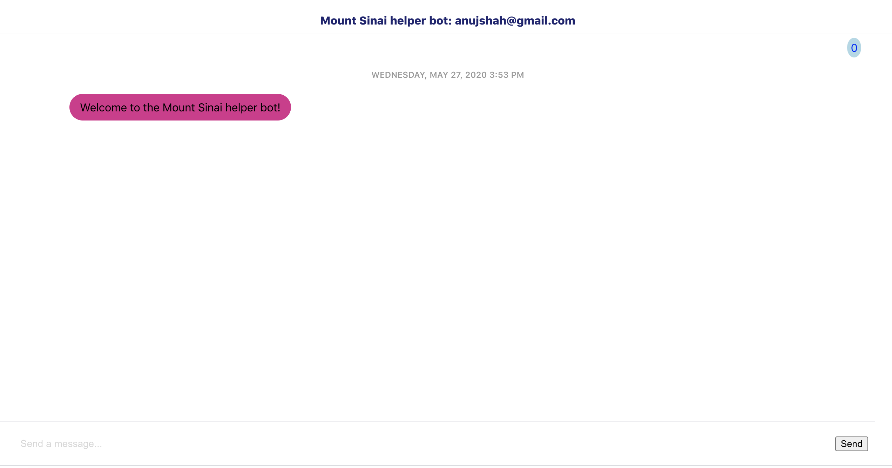

# Anuj Shah Mt.Sinai Chat Prototype

Chat Prototype for Anuj Shah 5/27/20

## Description

The app is full stack React and Golang chat prototype.

It keeps track of the number of messages and a database/persistence layer has been added as well using: http://gorm.io/ & https://github.com/gin-gonic/gin

The app uses web sockets for chat messages using: https://github.com/gorilla/websocket

For UI side the typescript version of create-react-app was used: https://create-react-app.dev/docs/adding-typescript/

Styling was done using styled components: https://styled-components.com/

### Prerequisites

Please follow below to get environment set up to run app

```
Please have the latest npm and node installed on your machine along with any command line tools.
Please have Go version 1.12+ installed on your machine along with any command line tools.
```

### Installing and running

Please follow along to get server and then app running to start playinng with app:

1. Please first cd into the server folder from the root directory of the app
2. Then run ann import of go libraries and the server

```
cd server/
go get
go run main.go
```

The server will then run at localhost:8080

---

3. Then from the root directory of the app and in a different terminal
4. Please install all npm/node libraries
4. Please cd into the app folder and run the start command

```
cd app/
npm install
npm run start
```

### To go through app:

Page 1:
Step 1 - Welcomes user and collects one input field, email. Offers “join chat” button.


Page 2:

Step 1 - User transitioned to a chat window which shows a message with their email that they joined the chat.

Step 2 - System automatically emits a welcome message introducing our Mount Sinai helper bot.

NOTE: If user has previously logged in before it will just re-render all their previous messages

Step 3 - User can type any number of other messages that append to the window chat room and a message counter at top increments up as each message is added live.

NOTE: The message counter counts the number of messages the user themselves have typed not total. This was done intentionally by adding a filter to the count. To display total messages this would be a quick fix in:

```
Toolbar.tsx line 16
```


